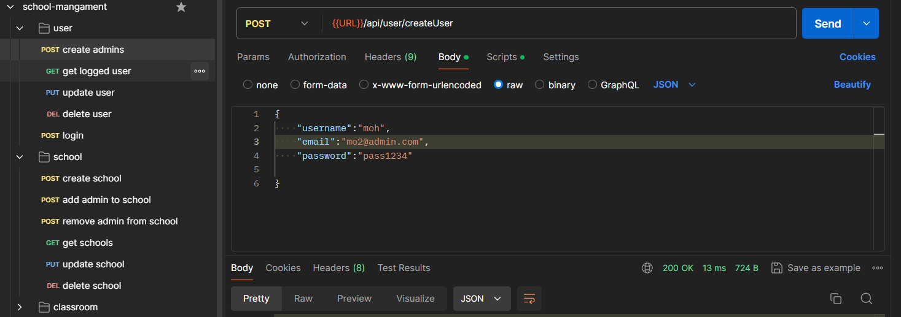

# Challange project School Managment Api 
## Every end point tested successfully with postman

## Documention for school managent api
we have 4 main entites that have end points **User** ,**School**, **Classroom** and **Student**
- **Super Admin** ->manage Schools
- **School Admin** ->manage Classrooms & Students
## 1- User end points

### Post: /api/user/createUser
#### Description
**createUser** make new user ,We have two kind of user **Super Admin** & **School Admin** 
#### Request :
**Body Paramaters**
- **username**  :(string)->username of admin
- **email**     :(string,unique)->email of admin
- **password**  :(string)->password mist be > 8 character
- **isAdmin**   :(boolean)->isadmin if true = Super Admin || false =School Admin (default false)
- **School**    :(string)->refer to only school admin belong to wish school (default "null")
#### Send Request :
    {
    "username":"mohamed osama",
    "email":"hr@schooladmin.com",
    "password":"pass1234",
    "school":"MUC Schools"
    }
#### Response :
    {
        "data": {
        "user": {
            "username": "mohamed osama",
            "email":"hr@schooladmin.com",
            "password":"pass1234",
            "school":"MUC Schools"
            "isAdmin": false,
            "_id": "668a2b284ded0954cd6cb5af",
        },
        "token": "eyJhbGciOi"
    },
    }
### Get: /api/user/getUser
#### Description
**getUser** get logged user 
#### Request :
**Headers Paramaters**
- **token** 
#### Response :
    "data": {
        "user": {
            "username": "mohamed osama",
            "email":"hr@schooladmin.com",
            "password":"pass1234",
            "school":"MUC Schools"
            "isAdmin": false,
            "_id": "668a2b284ded0954cd6cb5af",
        },

### Put: /api/user/updateUser
#### Description
**updateUser** updated logged user 
#### Request :
**Headers Paramaters**
- **token** 
**body Paramaters**
-  {
    "username":"any content",
    "password":"password"
}
#### Response :
    {
    "username":"any content",
    "password":"password"
    }
### Delete: /api/user/deleteUser -> **only Super Admin can access that end point**
#### Description
**deleteUser** delete any user by id user 
#### Request :
**Headers Paramaters**
- **token** -> to sure its super admin
**body Paramaters**
-  {
    "id":"445261",
}
### Post: /api/user/login 
#### Description
**login** normal signin
#### Request :
**body Paramaters**:       
 -                    {
            "email":"hr@schooladmin.com",
            "password":"pass123"
        }
#### Response : 
    {
    token:"ldadfa554ad54a"
    }
## 2- School end points -> only Super admin can access that end points
### Post: /api/school/createSchool 
#### Description
**createSchool** create school  by write school name
#### Request :
**Headers Paramaters**
- **token** -> to sure its super admin
**body Paramaters**:
-       {
             "name":"school name",
        }
#### Response : 
    "data": {
        "school": {
            "name": "school name",
            "classrooms": [],
            "admins": [],
            "_id": "668a68f6c98328176c8cc6e5",
            "createdAt": "2024-07-07T10:07:50.551Z",
            "updatedAt": "2024-07-07T10:07:50.551Z",
            "__v": 0
        },
        "message": "New school added"
    },
**school** have list of admin and list of class rooms
### Get: /api/school/getSchools 
#### Description
**getSchools** get all schools with thier admins
#### Request :
**Headers Paramaters**
- **token** -> to sure its super admin
#### Response : 
    "data": {
        "schools": {
            "name": "school name",
            "classrooms": [],
            "admins": [],
            "_id": "668a68f6c98328176c8cc6e5",
        },
        "message": "New school added"
    },
### Put: /api/school/updatedSchool 
#### Description
**getSchools**  update school by id
#### Request :
**Headers Paramaters**
- **token** -> to sure its super admin
**body Paramaters**:
-       {
             "name":"school name2",
             "id":"sa5d544a5sa"
        }
#### Response : 
    "data": {
        "schools": {
            "name": "school name2",

        },
    },
### delete: /api/school/deleteSchool 
#### Description
**getSchools**  update school by id
#### Request :
**Headers Paramaters**
- **token** -> to sure its super admin
**body Paramaters**:
-       {
             "id":"sa5d544a5sa"
        }
### Post: /api/school/addAdminToSchool 
#### Description
**addAdminToSchool** super admin can add school admin to specific school
#### Request :
**Headers Paramaters**
- **token** -> to sure its super admin
**body Paramaters**:
-       {
          "schoolName":"name",
        "email":"mo@schooladmin.com"
        }
#### Response : 
     "data": {
        "message": "added admin to school"
    },
### Post: /api/school/removeAdminFromSchool 
#### Description
**removeAdminFromSchool** super admin can remove school admin from specific school
#### Request :
**Headers Paramaters**
- **token** -> to sure its super admin
**body Paramaters**:
-       {
          "schoolName":"name",
        "email":"mo@schooladmin.com"
        }
#### Response : 
     "data": {
        "message": "remove admin form school"
    },
## 3- Classroom end points -> only school admin can access that end points
### Post: /api/classroom/createClassroom 
#### Description
**createClassroom** create Classroom  by write Classroom name
#### Request :
**Headers Paramaters**
- **token** -> to sure its school admin
**body Paramaters**:
-       {
             "name":"classroom name",
        }
#### Response : 
-       {"newClassroom": {
            "name": "H1",
            "school": "mots",
            "students": [],
            "_id": "668a697b2cdc44b6d009cf09",
            "__v": 0
        }
### Get: /api/classroom/getClassrooms 
#### Description
**getClassroom** get all Classrooms that in school
#### Request :
**Headers Paramaters**
- **token** -> to sure its school admin

#### Response :
-        {
            Classrooms:{
                "name": "H1",
                "school": "mots",
                "students": [],
            }
        }
### Put: /api/classroom/updateClassroom 
#### Description
**updateClassroom** update Classroom by id
#### Request :
**Headers Paramaters**
- **token** -> to sure its school admin
**body Paramaters**:
-       {
             "name":"classroom name",
             "id":"adaca"
        }
#### Response :
-       {
        "new classroom":{
             "name":"classroom name",
             "id":"adaca"
             }
        }
### delete: /api/classroom/deleteClassroom 
#### Description
**deleteClassroom** delete Classroom by id
#### Request :
**Headers Paramaters**
- **token** -> to sure its school admin
**body Paramaters**:
-       {
             "id":"adafhgca"
        }
## 4- Studens end points -> only school admin can access that end points
### Post: /api/student/createStudent 
#### Description
**createStudent** create student  by write student **name** , **emai** and **phone**
#### Request :
**Headers Paramaters**
- **token** -> to sure its school admin
**body Paramaters**:
-       {
        "name":"mohamed osama2",
        "email":"s1@student.com",
        "phone":"01022222223"
        }
#### Response : 
-       {"newStudent": {
            "studentName": "mohamed osama2",
            "email": "s1@student.com",
            "phone": "01022222223",
            "school": "ABC",
            "_id": "668af70047153298a7f8dbae",
        }
### Get: /api/student/getStudent 
#### Description
**getStudent** get Student by id
#### Request :
**Headers Paramaters**
- **token** -> to sure its school admin
**body Paramaters**:
-       {
        "id":"caaasdasdas515515scs",
        }
#### Response :
-        {"data": {
        "_id": "668af2b15ea8258bcc48e0ef",
        "studentName": "mohamed osama",
        "email": "s1@student.com",
        "phone": "01022222223"}
        }
### Get: /api/student/getStudentsInSchool 
#### Description
**getStudentsInSchool** get all Student that in school
#### Request :
**Headers Paramaters**
- **token** -> to sure its school admin
#### Response :
-        {"data": {
        "_id": "668af2b15ea8258bcc48e0ef",
        "studentName": "mohamed osama",
        "email": "s1@student.com",
        "phone": "01022222223"}
        }
### Put: /api/student/updateStudent
#### Description
**updateStudent** update Student by id
#### Request :
**Headers Paramaters**
- **token** -> to sure its school admin
**body Paramaters**:
-       {
            "id":"668af6fa47153298a7f8dbaa",
          "name":"osos",
         "phone":"010224554"
        }
#### Response :
-       {
        "new student":{
             "id":"668af6fa47153298a7f8dbaa",
            "name":"osos",
            "phone":"010224554"
             }
        }
### delete: /api/student/deleteStudent 
#### Description
**deleteStudent** delete student by id
#### Request :
**Headers Paramaters**
- **token** -> to sure its school admin
**body Paramaters**:
-       {
             "id":"adafhgca"
        }
### Post: /api/student/addStudentToClassroom 
#### Description
**addAdminToSchool** school admin can add student  to specific classrom
#### Request :
**Headers Paramaters**
- **token** -> to sure its school admin
**body Paramaters**:
-       {
          "className":"name",
        "email":"s1@student.com"
        }
#### Response : 
     "data": {
        "message": "added student to classroom"
    },
### Post: /api/student/removeStudentFromClassroom 
#### Description
**removeStudentFromClassroom** school admin can remove student from specific classroom
#### Request :
**Headers Paramaters**
- **token** -> to sure its school admin
**body Paramaters**:
-       {
          "className":"name",
        "email":"s1@student.com"
        }
#### Response : 
     "data": {
        "message": "remove student form classroom"
    },